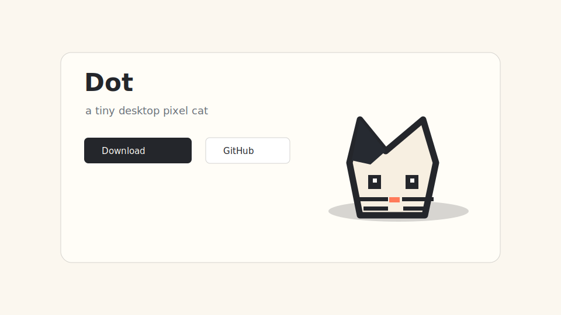

# Dot

Dot is a tiny open-source desktop pixel cat for macOS. It opens a transparent always-on-top companion window with an original canvas-drawn cat that reacts to cursor movement, dragging, petting, typing signals, reminders, and Pomodoro sessions.



## Download

For normal users, download the latest macOS release from GitHub Releases:

```text
https://github.com/Anshumaan657/Dot/releases/latest
```

Download the `.dmg`, open it, drag `Dot.app` into Applications, then launch Dot.

## Run From Source

```bash
cd Dot
npm install
npm start
```

## Build The Mac App

Build a local `.app`:

```bash
npm run make:mac
```

Create release files for users:

```bash
npm run dist
```

The generated `.dmg` and `.zip` files appear in `dist/`.

> Public release note: unsigned macOS apps may show a Gatekeeper warning. For the smoothest public install, sign and notarize the app with an Apple Developer ID before publishing releases.

## Settings

You can access Dot settings in three ways:

- Click the Dot menu bar icon.
- Right-click the cat and choose `Settings`.
- Use `Dot > Settings` from the macOS app menu.

Settings include colors, reminders, Pomodoro, keyboard watch, full-screen hiding, startup, show, minimize, and quit.

## Landing Page

The landing page is in `site/`. It is static HTML/CSS, so it can be deployed with GitHub Pages, Netlify, Vercel, or any static host.

For GitHub Pages, publish the `site/` folder. The expected URL will be:

```text
https://anshumaan657.github.io/Dot/
```

See [docs/DEPLOYMENT.md](docs/DEPLOYMENT.md) for the first public launch checklist.

## Notes

Keyboard watch uses Electron global shortcuts. Some systems will not allow plain letter shortcuts globally, and macOS may require privacy permissions for deeper keyboard monitoring. The app still works without keyboard watch: open settings and use `Tap paws` to test the typing animation.

This project intentionally draws its own original pixel cat in canvas. No paid app assets or copyrighted character assets are used.

## Contributing

Dot is small on purpose. Keep changes focused, friendly, and easy to run locally. See [CONTRIBUTING.md](CONTRIBUTING.md).

## License

MIT. See [LICENSE](LICENSE).
